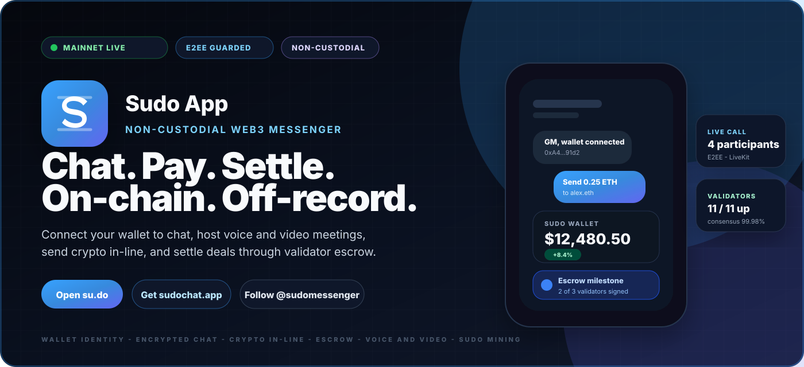
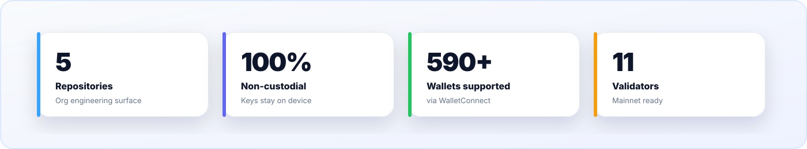
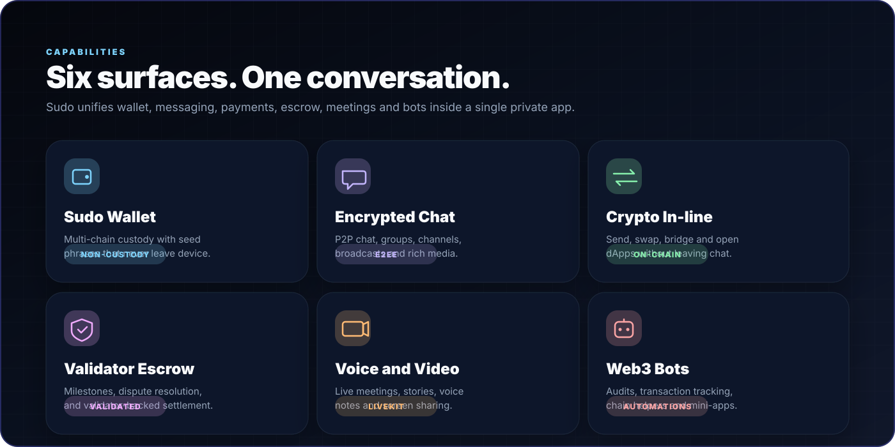
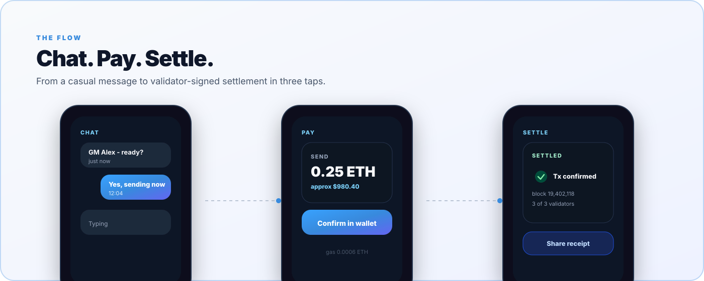
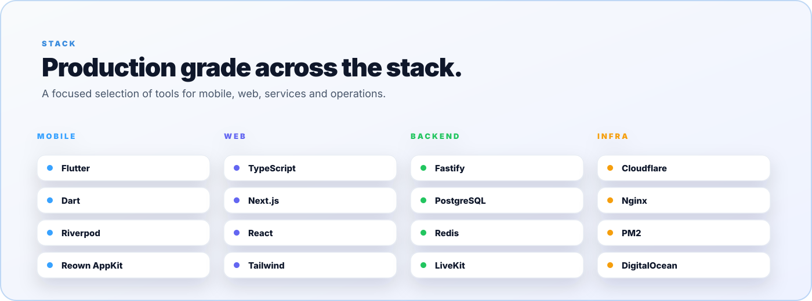

 

### [Website](https://su.do) &nbsp;·&nbsp; [App](https://sudochat.app) &nbsp;·&nbsp; [Protocol Console](https://protocol.sudochat.app) &nbsp;·&nbsp; [X / Twitter](https://x.com/sudomessenger) &nbsp;·&nbsp; [All Links](https://su.do/sudomessenger)

 

 

 

 

 

 

