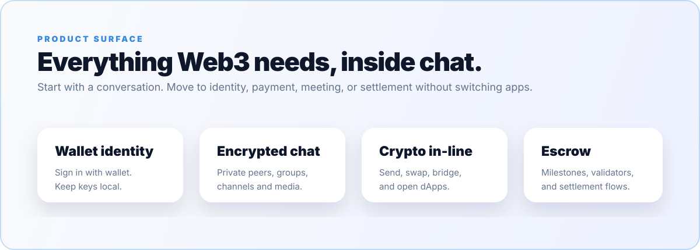
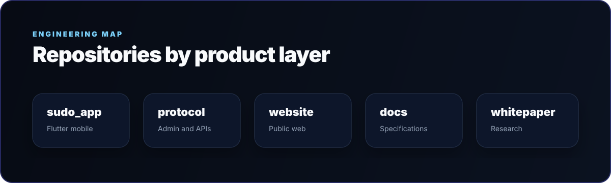
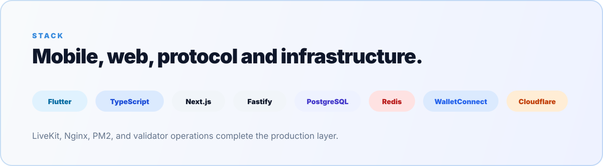

 

[**Website**](https://su.do) &nbsp;|&nbsp; [**App**](https://sudochat.app) &nbsp;|&nbsp; [**Protocol Console**](https://protocol.sudochat.app) &nbsp;|&nbsp; [**X / Twitter**](https://x.com/sudomessenger) &nbsp;|&nbsp; [**All Links**](https://su.do/sudomessenger)

 

 

 

 

  

**Sudo** - messaging, wallet, and on-chain trust in one non-custodial app.

  

[**su.do**](https://su.do) &nbsp;|&nbsp; [**sudochat.app**](https://sudochat.app) &nbsp;|&nbsp; [**@sudomessenger**](https://x.com/sudomessenger) &nbsp;|&nbsp; [**legal@sudochat.app**](mailto:legal@sudochat.app)

