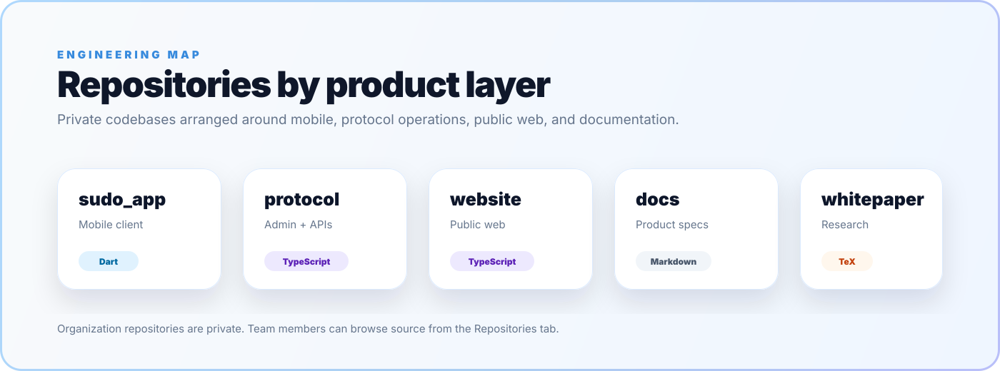

 

[**Website**](https://su.do) · [**App**](https://sudochat.app) · [**Protocol Console**](https://protocol.sudochat.app) · [**X / Twitter**](https://x.com/sudomessenger) · [**All Links**](https://su.do/sudomessenger)

## Sudo turns chat into a Web3 command surface.

Wallet identity, encrypted messaging, crypto payments, voice/video, bots, and validator-secured escrow live together in one non-custodial app.

[**Website**](https://su.do) · [**App**](https://sudochat.app) · [**Protocol Console**](https://protocol.sudochat.app) · [**X / Twitter**](https://x.com/sudomessenger) · [**All Links**](https://su.do/sudomessenger) · [**Legal**](mailto:legal@sudochat.app)

 

  

**Sudo** — messaging, wallet, and on-chain trust in one non-custodial app.

 

© Sudo Governing Council · "Sudo", "Sudo Chat", and the Sudo logo are trademarks of the Sudo Governing Council.

